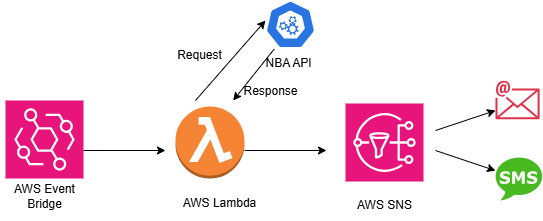

# NBA Game Notification App

Welcome to **Day 2** of my **30 Days DevOps Challenge**! 🎉 This project is part of the [#DevOpsAllStarsChallenge](https://twitter.com/hashtag/DevOpsAllStarsChallenge) where I explore and implement various DevOps practices and tools. Today, we're diving into building an **NBA Game Notification App** that keeps you updated with the latest NBA game scores via email or SMS.

## Table of Contents

- [Overview](#overview)
- [Project Features](#project-features)
- [Architecture](#architecture)
- [Technologies Used](#technologies-used)
- [How It Works](#how-it-works)
- [Getting Started](#getting-started)
- [Join the Challenge](#join-the-challenge)

## Overview

The **NBA Game Notification App** is designed to provide real-time updates on NBA game scores directly to your inbox or phone. Whether you're a die-hard basketball fan or just want to stay informed, this app ensures you never miss out on the action. Leveraging AWS's serverless architecture, the app efficiently fetches game data, processes it, and delivers notifications seamlessly.

## Project Features

- **Real-Time Notifications:** Receive updates on game scores as they happen.
- **Customizable Alerts:** Choose to get notifications via email or SMS.
- **Scalable Architecture:** Built using AWS services to handle varying loads without manual intervention.
- **Event-Driven Design:** Automates the workflow, ensuring timely delivery of notifications without constant monitoring.

## Architecture

The architecture of the NBA Game Notification App is based on an **event-driven** model, utilizing several AWS services to create a seamless and automated notification system.

### Components

1. **AWS EventBridge:**
   - Acts as the scheduler, triggering events at specified intervals (e.g., every 2 hours).
   
2. **AWS Lambda:**
   - Executes the core logic to fetch NBA game data from an external API, processes the information, and prepares it for notification.
   
3. **AWS SNS (Simple Notification Service):**
   - Handles the distribution of notifications to subscribed endpoints such as email addresses or phone numbers.

## Technologies Used

- **AWS Services:**
  - **Lambda:** Serverless compute service to run code without provisioning servers.
  - **SNS:** Managed service for sending messages to multiple subscribers.
  - **EventBridge:** Serverless event bus to connect application data from various sources.
  - **IAM:** Manages access and permissions for AWS resources.
  
- **Programming Language:**
  - **Python:** Used for writing the Lambda function due to its simplicity and robust libraries for API interactions.

- **External API:**
  - **SportsData.io API:** Provides real-time NBA game data, including scores, team information, and game statuses.

## How It Works

1. **Scheduling with EventBridge:**
   - **EventBridge** is configured to trigger the Lambda function at regular intervals (e.g., every 2 hours) between specific times (e.g., 9 AM to 2 AM).
   
2. **Data Retrieval and Processing:**
   - When triggered, the **Lambda function** makes a request to the **SportsData.io API** to fetch the latest NBA game data.
   - It processes the received JSON data to extract relevant information such as game status, teams, and scores.
   
3. **Publishing Notifications:**
   - The processed information is then sent to an **SNS topic**.
   - Subscribers to this SNS topic (via email or SMS) receive the game updates automatically.
   
4. **Secure and Scalable:**
   - **IAM Roles and Policies** ensure that the Lambda function has the necessary permissions to interact with SNS and other AWS services securely.
   - The serverless architecture ensures that the system scales effortlessly based on demand without manual intervention.

## Getting Started

To set up and deploy the NBA Game Notification App, follow these general steps:

### Clone the Repository

### Set Up AWS Services

1. **Create an SNS Topic and Subscribe Your Email or Phone Number:**
   - Navigate to the AWS SNS service.
   - Create a new SNS topic (e.g., `GameDayTopic`).
   - Subscribe your email address or phone number to the SNS topic and confirm the subscription.

2. **Configure IAM Roles and Policies to Grant Necessary Permissions to the Lambda Function:**
   - Use AWS IAM to create a policy that allows the Lambda function to publish to the SNS topic.
   - Create an IAM role for the Lambda function and attach the created policy along with the basic execution role.

3. **Deploy the Lambda Function Using the Provided Python Script:**
   - Navigate to AWS Lambda service.
   - Create a new Lambda function (e.g., `GD_Notifications`) using Python as the runtime.
   - Attach the previously created IAM role to the Lambda function.
   - Upload or paste the Python script into the Lambda function code editor and deploy.

4. **Set Environment Variables for API Keys and SNS Topic ARN:**
   - In the Lambda function configuration, set environment variables for the SportsData.io API key (`API_KEY`) and the SNS Topic ARN (`SNS_TOPIC_ARN`).

5. **Configure EventBridge to Schedule the Lambda Function Execution:**
   - Navigate to AWS EventBridge.
   - Create a new rule with a cron expression to trigger the Lambda function at desired intervals (e.g., every 2 hours between 9 AM and 2 AM).

### Test the Setup

1. **Manually Trigger the Lambda Function to Ensure Notifications Are Working as Expected:**
   - In the Lambda console, create a test event and invoke the function manually.
   - Check the Lambda logs to ensure it executed successfully.

2. **Verify That You Receive the Notifications on Your Subscribed Endpoints:**
   - Check your email or SMS for the game notifications sent by the SNS topic.

## Join the Challenge

I'm excited to share my journey through this **30 Days DevOps Challenge**! Follow along, contribute, and share your progress using the hashtag [#DevOpsAllStarsChallenge](https://twitter.com/hashtag/DevOpsAllStarsChallenge). Let's learn and grow together in the world of DevOps!
